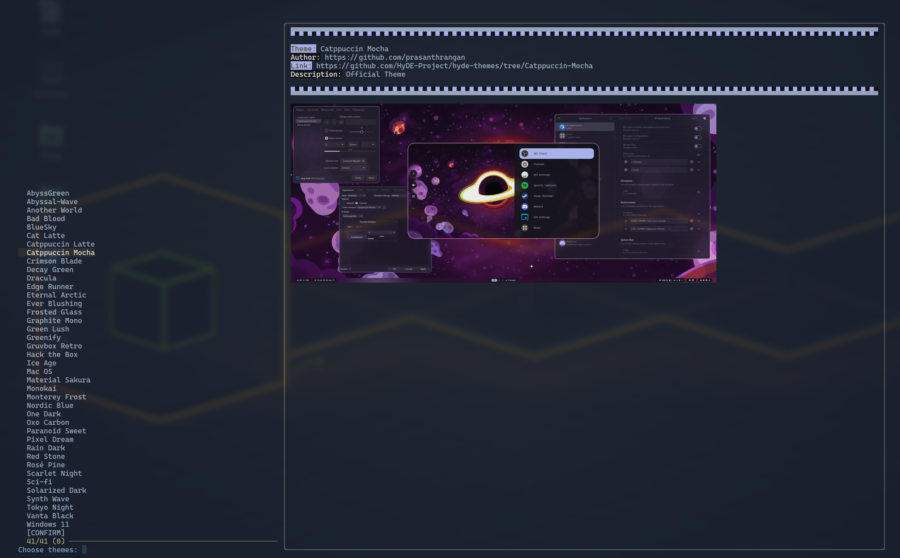

### Vorschau



### NAME

theme.import.py - Importiert Themes aus dem HyDE-Galerie-Repository

### SYNOPSIS

`theme.import.py` [OPTIONEN]

### BESCHREIBUNG

`theme.import.py` ist ein Skript zum Importieren und Verwalten von Themes aus dem HyDE-Galerie-Repository. Es ermöglicht Benutzern, das Repository zu klonen, Theme-Daten abzurufen, Themes in der Vorschau anzuzeigen und ausgewählte Themes anzuwenden.

### OPTIONEN

- `-j`, `--json`
  JSON-Daten nach dem Klonen des Repositories abrufen.

- `-S`, `--select`
  Themes mit `fzf` auswählen.

- `-p`, `--preview` IMAGE_URL
  Vorschau des angegebenen Themes anzeigen.

- `-t`, `--preview-text` TEXT
  Vorschautext anzeigen, wenn die Option `--preview` verwendet wird.

- `--skip-clone`
  Überspringt das Klonen des Repositories.

- `-f`, `--fetch` THEME
  Ein bestimmtes Theme nach Name abrufen und aktualisieren. Verwenden Sie `all`, um alle Themes in `xdg_config/hyde/themes` abzurufen.

### UMGEBUNGSVARIABLEN

- `LOG_LEVEL`
  Legt die Protokollebene fest (Standard: `INFO`).

- `XDG_CACHE_HOME`
  Verzeichnis für Cache-Dateien (Standard: `~/.cache`).

- `XDG_CONFIG_HOME`
  Verzeichnis für Konfigurationsdateien (Standard: `~/.config`).

- `FULL_THEME_UPDATE`
  Überschreibt die archivierten Dateien (nützlich für Updates und Änderungen in Archiven).

### BEISPIELE

Öffnet das fzf-Menü und ermöglicht die Auswahl von Themes.

```shell
theme.import.py --select
```
