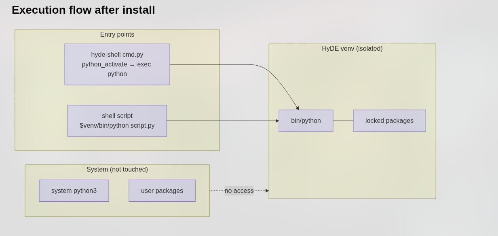

## Name

`python-env` - HyDE Python virtual environment manager

## Synopsis

```bash
python-env [command] [options]
```

## Description

`python-env` is HyDE's Python virtual environment manager built on top of [`uv`](https://github.com/astral-sh/uv). It manages an **isolated** virtual environment stored under `$XDG_STATE_HOME/hyde/python_env` (usually `~/.local/state/hyde/python_env`), completely separate from your system Python and any user packages.

HyDE Python scripts run inside this environment. You can extend it with extra packages without touching your system Python installation.

### How it works



HyDE scripts reach the isolated environment through two entry points:

- **`hyde-shell cmd.py`** — activates the venv via `python_activate`, then `exec`s the Python interpreter.
- **Shell scripts** — call `$venv/bin/python script.py` directly.

The system Python and user packages are never accessed.

## Commands

### `create`

```bash
python-env create
```

Creates the virtual environment and installs all dependencies from `pyproject.toml`. If a valid venv already exists, it is skipped. If a broken one is detected, it is destroyed and rebuilt automatically.

---

### `sync`

```bash
python-env sync
```

Syncs dependencies from `pyproject.toml` into the existing environment. Use this after pulling HyDE updates to ensure the environment is up to date.

---

### `install`

```bash
python-env install <package> [package ...]
```

Installs one or more packages into the HyDE venv using `uv add`. The package is added to `pyproject.toml` so it persists across rebuilds.

**Example:**

```bash
python-env install requests pillow
```

---

### `uninstall`

```bash
python-env uninstall <package> [package ...]
```

Removes one or more packages from the HyDE venv using `uv remove`. Also removes the package from `pyproject.toml`.

**Example:**

```bash
python-env uninstall pillow
```

---

### `destroy`

```bash
python-env destroy
```

Removes the entire virtual environment directory. Does **not** modify `pyproject.toml`. Run `create` or `sync` afterwards to recreate it.

---

### `rebuild`

```bash
python-env rebuild
```

Destroys the virtual environment and recreates it from scratch by running `sync`. Useful when the environment becomes corrupted or after a Python version change.

---

### `uv`

```bash
python-env uv [--hyde] <uv-args> ...
```

Passes arguments directly to the underlying `uv` executable. Use `--hyde` to scope the command to HyDE's venv and project directory.

**Options:**

**`--hyde`**
: Injects `UV_PROJECT_ENVIRONMENT` and `--project` so the raw `uv` command operates on HyDE's venv. Without this flag, the command runs as a plain `uv` call with no HyDE context.

**Examples:**

```shell
# List installed packages in HyDE's venv
python-env uv --hyde pip list

# Run uv tree scoped to the HyDE project
python-env uv --hyde tree
```

## Optional Dependencies

Some HyDE features ship as **optional dependency groups** in `pyproject.toml`. These are not installed by default to keep the environment lean.

### Available extras

| Extra | Packages | When to install |
|-------|----------|-----------------|
| `amd` | `pyamdgpuinfo` | AMD GPU monitoring widgets |

### Installing an extra

Use the `uv` subcommand with `--extra`:

```bash
python-env uv --hyde sync --extra amd
```

This installs only the packages declared under `[project.optional-dependencies]` for that extra. It does **not** affect the rest of the environment.

:::caution
Do **not** use `python-env install pyamdgpuinfo` for optional extras — that would add the package as a regular dependency and may conflict with future HyDE updates. Always use `uv sync --extra <name>` for declared extras.
:::

## Installing your own packages safely

You can extend the HyDE venv with your own packages. The key rule is: **only add packages that HyDE does not declare**.

```bash
# Safe — adding a package HyDE doesn't know about
python-env install my-tool

# After adding, sync is automatic — no extra step needed
```

To keep your additions across rebuilds:

1. Your packages are written to `pyproject.toml` by `uv add`, so they survive `sync`.
2. A full `rebuild` will re-install everything listed in `pyproject.toml`, including your additions.

:::tip
If a package you need conflicts with a HyDE dependency, do **not** force-install it into the HyDE venv. Instead, create a separate venv for your own script and manage it independently with `uv`.
:::

## Environment Variables

**`UV_PROJECT_ENVIRONMENT`**
: Overrides the venv path used by `uv`. Set internally by `python-env` to `$XDG_STATE_HOME/hyde/python_env`.

**`XDG_STATE_HOME`**
: Base directory for the venv (default: `~/.local/state`). The venv lives at `$XDG_STATE_HOME/hyde/python_env`.

## Files

| Path | Description |
|------|-------------|
| `$XDG_STATE_HOME/hyde/python_env/` | Virtual environment root |
| `$XDG_STATE_HOME/hyde/python_env/bin/python` | Python interpreter used by HyDE scripts |
| `<hyde-dir>/pyproject.toml` | Dependency declarations |
| `<hyde-dir>/uv.lock` | Lockfile — do not edit manually |

## Examples

**First-time setup:**

```bash
python-env create
```

**Update after pulling HyDE changes:**

```bash
python-env sync
```

**Install AMD GPU support:**

```bash
python-env uv --hyde sync --extra amd
```

**Add a personal package:**

```bash
python-env install python-dotenv
```

**Nuke and rebuild a broken environment:**

```bash
python-env rebuild
```

**Inspect what is installed:**

```shell
python-env uv --hyde pip list
```
