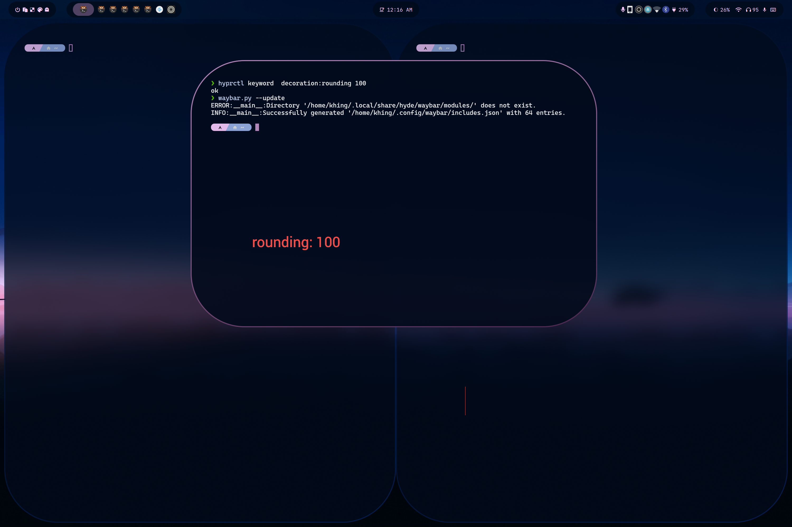
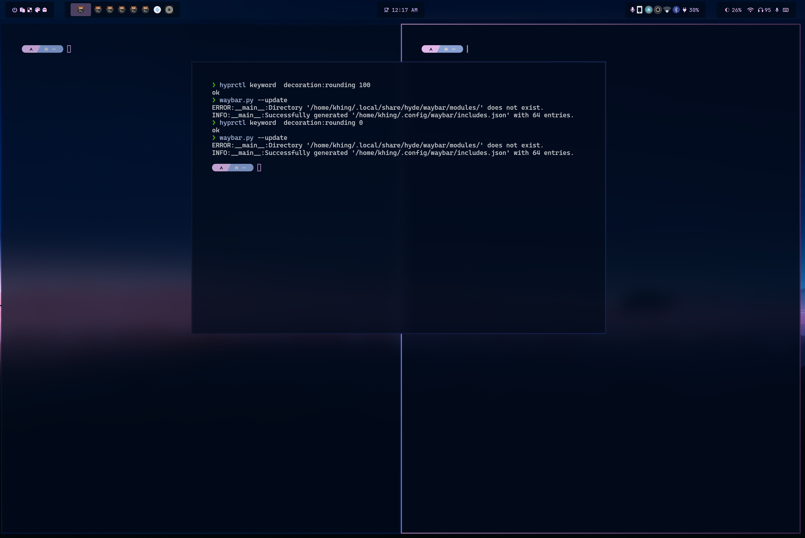

## Configuration Tree

```

. 📂 xdg_config/waybar
└── 📂 layouts/
└── 📂 menus/
└── 📂 modules/
└── 📂 styles/
└── 📂 includes/
├── 📄 config.jsonc
├── 📄 style.css
├── 📄 theme.css
└── 📄 user-style.css
```

- **config.jsonc**
  - copy of a layout configuration. See [layouts](#layouts).
  - a transient file therefore edits must be saved at `xdg_config_home/waybar/layouts`
- **stye.css**

  - auto-generated file.
  - style.css imports 3 files:
    - **current** `style/*.css` that matches the `layout.json`. See [styles](#styles)
    - **theme.css** generated by themes and this can override the selected style.
    - **user-style.css** is an optional file where you can add you own overrides. You can also test your CSS in here.

- **theme.css**
  - theme generated file.

### modules

Directory: ./modules/

```
└── 📂 modules/
│  ├── 📄 backlight.jsonc
│  ├── 📄 clock.jsonc
│  ├── 📄 cpu.jsonc
│  ├── 📄 custom-cpuinfo.jsonc
│  ├── 📄 hyprland-language.jsonc
│  ├── 📄 idle_inhibitor.jsonc
│  ├── 📄 pulseaudio#microphone.jsonc
│  ├── 📄 pulseaudio.jsonc
│  ├── 📄 tray.json
│  ├── 📄 wlr-taskbar#windows.json
│  ├── 📄 wlr-taskbar.json
```

- Store all modules in **xdg_config_home/waybar/modules**.
- Files in here are recursively added as entry in `includes/includes.json`
- all modules under a specific tree will have the `parent-child` convention. Example, `custom/cpuinfo` will be converted into `custom-cpuinfo`. This is used to easily determine the class name in CSS without confusion.
  example:
  custom-cpuinfo {
  padding: 1em;
  }

### layouts

Directory: ./layouts/

```
...
└── 📂 layouts/
│  ├── 📄 layout-1.jsonc
│  ├── 📄 layout-2.jsonc
│  ├── 📄 khing.jsonc
│  ├── 📄 macos.jsonc
│  ├── 📄 ....jsonc
...


```

HyDE stores all the ready to use configuration to `layouts` directory. These can be navigated using the `waybar.py` script.

:::note
If users accidentally configure `./waybar/config.jsonc`, It will be moved into `xdg_config/waybar/layouts/timestamp.jsonc`. Even having this measures, we encourage to create a copy of your configuration in `xdg_config/waybar/layouts/`

:::

For css styling of the layouts see [styles](#styles)

### styles

Directory: ./styles/

```
└── 📂 styles/
│  └── 📂 groups/
│  ├── 📄 layout-1.css
│  ├── 📄 layout-2.css
│  ├── 📄 khing.css
│  ├── 📄 macos.css
│  ├── 📄 ...*.css

```

The `styles ` are the counterpart of layouts.
When choosing a layout, HyDE will try to use the equivalent CSS style by matching the base names e.g. `khing.jsonc` will use `khing.css`.

Explicit `--config <file> ` and `--style <file>` is also supported.

### includes

Directory: ./includes/

```
...
└── 📂 includes/
│  ├── 📄 includes.jsonc
│  ├── 📄 border-radius.css
│  ├── 📄 global.css
...


```

- **border-radius.css**
  - dynamic border radius for the [groups](#groups).

**dynamic border-radius preview**

**Circle** 100 rounding in hyprland



**Squircle** 0 rounding in hyprland


**Something between** 5 rounding in hyprland



**Get the Idea?**

- **global.css** - includes the dynamic font-size, and font-family. - This is dynamic so that themes can override these values via the `hypr.theme` >> `$WAYBAR_FONT`

### menus

Stores all the GTK Object XML files. To correctly manage the files we added the GObject XML files in ` xdg_confg_home/wayabr/menus`

## Group class for styling

Contents of `../waybar/styles/groups/` are use for styling the border-radius of the given group. Groups are the combination of modules some call it islands.

In HyDE, to be able to make use of the groups, we can declare modules in a group first:

Example in `~/.config/waybar/layouts/my_config.jsonc`

```jsonc
...
{
  "group/pill": {
    "orientation": "inherit",
    "modules": [
    "custom/gpuinfo",
    "clock"
     ]
  }
}
...
```

Now we can add the group in the waybar modules:

```
"modules-center" : [
"group/pill",
"group/pill#tag1"
"group/pill-in",
....
]
}
```

**Styling** this is easy as we already group the modules. In this way we can use the group name as the class name

```
#pill,
#pill-in,


```

Note: `pill` and `pill#tag*` have a class name of ` pill`. This is waybar convention to enable users add a similar module but sharing common class name.
