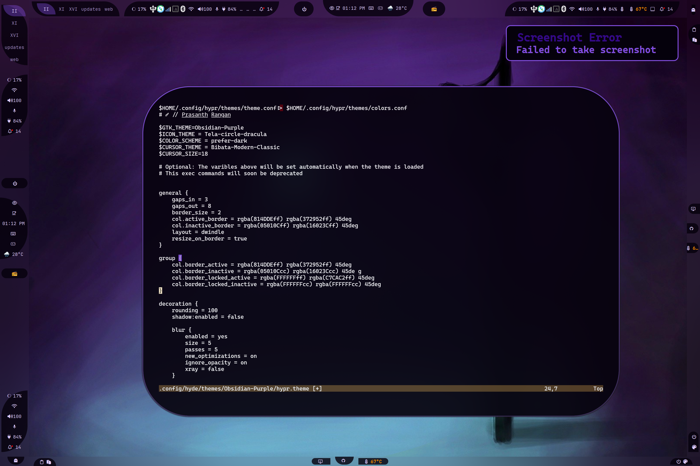
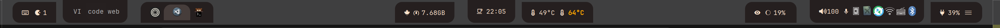

## Struktur Konfigurasi

```text
📂 ~/.config/waybar/
├── 📂 layouts/
├── 📂 menus/
├── 📂 modules/
├── 📂 styles/
├── 📂 includes/
├── 📄 config.jsonc
├── 📄 style.css
├── 📄 theme.css
└── 📄 user-style.css
```

- **config.jsonc**
  - Salinan dari konfigurasi layout. Lihat [layouts](#layouts).
  - File bersifat sementara, jadi perubahan harus disimpan di `~/.config/waybar/layouts/`
- **style.css**
  - File yang dibuat secara otomatis.
  - style.css mengimpor 3 file:
    - **Current** `styles/*.css` yang sesuai dengan `layout.jsonc`. Lihat [styles](#styles)
    - **theme.css** yang dihasilkan oleh tema dan dapat menimpa style yang dipilih.
    - **user-style.css** adalah file opsional tempat untuk menambahkan styling custom. Anda juga bisa menguji CSS disini.

- **theme.css**
  - File yang otomatis dihasilkan dari tema.

:::note
Anda harus memahami bahwa  `xdg_share/waybar` (~/.local/share/waybar) adalah direktori yang disediakan oleh HyDE. JANGAN PERNAH mengedit file pada direktori tersebut, karena perubahan anda akan ditimpa saat ada pembaruan. Sebaiknya edit konfigurasi Anda pada direktori `~/.config/waybar`! 

Perhatikan bahwa keduanya memiliki struktur yang sama, dan saya sarankan Anda menyalin file dari `xdg_share/waybar` ke `~/.config/waybar`, lalu mengeditnya disana.

:::

### Modules

Direktori: `./modules/`

```text
└── 📂 modules/
   ├── 📄 backlight.jsonc
   ├── 📄 clock.jsonc
   ├── 📄 cpu.jsonc
   ├── 📄 custom-cpuinfo.jsonc
   ├── 📄 hyprland-language.jsonc
   ├── 📄 idle_inhibitor.jsonc
   ├── 📄 pulseaudio#microphone.jsonc
   ├── 📄 pulseaudio.jsonc
   ├── 📄 tray.jsonc
   ├── 📄 wlr-taskbar#windows.jsonc
   └── 📄 wlr-taskbar.jsonc
```

- Simpan semua modul di `~/.config/waybar/modules/`.
- File di dalam direktori ini akan didaftarkan secara rekursif sebagai entri di `includes/includes.jsonc`
- Semua modul mengikuti konvensi penamaan induk-anak (parent-child) berdasarkan struktur direktori. Sebagai contoh, `custom/cpuinfo` akan dikonversi menjadi `custom-cpuinfo`. Konvensi ini digunakan untuk menentukan nama class CSS secara jelas dan konsisten, sehingga menghindari kebingungan maupun konflik penamaan.

Contoh:
```css
.custom-cpuinfo {
  padding: 1em;
}
```

### Layouts

Direktori: `./layouts/`

```text
└── 📂 layouts/
   ├── 📄 layout-1.jsonc
   ├── 📄 layout-2.jsonc
   ├── 📄 khing.jsonc
   ├── 📄 macos.jsonc
   └── 📄 ....jsonc
```

HyDE menyimpan semua konfigurasi siap pakai di direktori `layouts/`. Konfigurasi ini dapat diakses menggunakan skrip `hyde-shell waybar`.

:::note
Jika pengguna tanpa sengaja mengonfigurasi `./waybar/config.jsonc`, berkas tersebut akan dipindahkan ke `~/.config/waybar/layouts/backup/name_timestamp.jsonc`. Meskipun sudah ada mekanisme ini, kami tetap menyarankan untuk membuat salinan konfigurasi Anda di `~/.config/waybar/layouts/`.
:::

Untuk pengaturan gaya (CSS) pada layout, lihat bagian [styles](#styles).

### Styles

Direktori: `./styles/`

```text
└── 📂 styles/
   └── 📂 groups/
   ├── 📄 layout-1.css
   ├── 📄 layout-2.css
   ├── 📄 khing.css
   ├── 📄 macos.css
   └── 📄 ...*.css
```

Direktori `styles/` berisi berkas CSS yang menjadi pasangan (counterpart) untuk setiap layout.
Saat memilih sebuah layout, HyDE akan mencoba menggunakan gaya CSS yang sesuai dengan mencocokkan nama berkas. Misalnya `khing.jsonc` akan menggunakan `khing.css`.

Opsi eksplisit `--config <file>` dan `--style <file>` juga didukung.

### Includes

Direktori: `./includes/`

```text
└── 📂 includes/
   ├── 📄 includes.jsonc
   ├── 📄 border-radius.css
   └── 📄 global.css
```

- **border-radius.css**
  - Mengatur border-radius dinamis untuk [groups](#groups).

#### Pratinjau Border-Radius Dinamis

**Tanpa Pembulatan** di Hyprland


**Squircle** (pembulatan 10) di Hyprland


**Lingkaran** (pembulatan 100) di Hyprland



**Sudah kebayang, kan?**

- **global.css** - Berisi pengaturan ukuran font dan jenis font yang bersifat dinamis. Nilai ini dibuat dinamis agar tema dapat menimpa (override) pengaturan tersebut melalui `hypr.theme` >> `$BAR_FONT`

### Menus

Direktori: `./menus/`

Menyimpan semua berkas GTK Object XML. Untuk mengelola berkas dengan benar, kami menempatkan berkas GObject XML di `~/.config/waybar/menus/`.

## Group Class for Styling

Perlu diketahui bahwa Waybar HANYA menyediakan 3 opsi penempatan modul: `modules-left`, `modules-center` dan `modules-right`. Untuk mencapai tata letak tertentu atau efek populer seperti pill, kita perlu menggunakan class `group`. 

Contoh:


Isi direktori `../waybar/styles/groups/` digunakan untuk mengatur border-radius dari group yang bersangkutan. Group merupakan kombinasi beberapa modul -- sebagian orang menyebutnya *islands*.

Di HyDE, agar dapat memanfaatkan group, kita perlu mendeklarasikan modul di dalam sebuah group terlebih dahulu.


Misalnya di `~/.config/waybar/layouts/my_config.jsonc`:

```jsonc
{
  "group/pill": {
    "orientation": "inherit",
    "modules": [
      "custom/gpuinfo",
      "clock"
    ]
  }
}
```

Selanjutnya, group tersebut dapat ditambahkan ke posisi modul Waybar:

```jsonc
{
  "modules-center": [
    "group/pill",
    "group/pill#tag1",
    "group/pill-in"
  ]
}
```

**Styling** melakukan styling menjadi mudah karena modul sudah dikelompokkan.
Dengan cara ini, nama group dapat digunakan langsung sebagai class CSS:

```css
#pill,
#pill-in {
  /* Tambahkan styling Anda di sini */
}
```

**Catatan:** `pill` dan `pill#tag*` memiliki class name yang sama, yaitu `pill`.
Ini adalah konvensi Waybar untuk memungkinkan pengguna menambahkan modul serupa
dengan class yang sama.


## Membuat Layout Waybaar Anda Sendiri

:::note

Ini hanyalah panduan singkat. Untuk informasi lebih lengkap, silahkan merujuk ke [waybar Wiki](https://github.com/Alexays/Waybar/wiki/Configuration).

:::


### Contoh Konfigurasi File Layout

<details open>
  <summary>MyBar.jsonc</summary>

```jsonc
{
  /* 
  ┌─────────────────────────────────────────────────────────────────────────────┐
  │     Global Options for the Waybar configuration                             │
  └─────────────────────────────────────────────────────────────────────────────┘
 */

  "layer": "top",
  "output": ["*"],
  "position": "top",
  "reload_style_on_change": true,

  /* 
  ┌────────────────────────────────────────────────────────────────────────────┐
  │                                                                            │
  │ This is one of the vital part of the configuration, it allows you to       │
  │ include other                                                              │
  │ files                                                                      │
  │ The `"$XDG_CONFIG_HOME/waybar/includes/includes.json"` is auto generated   │
  │ by the waybar.py                                                           │
  │ script.                                                                    │
  │ 1. Includes all the modules in `./waybar/modules`                          │
  │ 2. Resolves all the size for the icons that the style.css in waybar        │
  │ CANNOT                                                                     │
  │ handle                                                                     │
  │ 3. Of course this is optional, you can remove it if you don't want to use  │
  │ it and                                                                     │
  │ include your own set of modules.                                           │
  │                                                                            │
  └────────────────────────────────────────────────────────────────────────────┘
 */

  "include": ["$XDG_CONFIG_HOME/waybar/includes/includes.json"],

  /* 
  ┌────────────────────────────────────────────────────────────────────────────┐
  │ Declare the modules inside your desired group shapes                       │
  │  As of now we have:                                                        │
  │                                                                            │
  │ - pill-left - the curve is facing left                                     │
  │ - pill-right - the curve is facing right                                   │
  │ - pill-up - the curve is facing up                                         │
  │ - pill-down - the curve is facing down                                     │
  │ - pill-in - the curve is facing inwards no matter the position             │
  │ - pill-out - the curve is facing outwards no matter the position           │
  │ - leaf - a leaf shape                                                      │
  │ - leaf-inverse - a leaf shape but inverted                                 │
  │                                                                            │
  └────────────────────────────────────────────────────────────────────────────┘
 */

  "group/pill-left": {
    "orientation": "inherit",
    "modules": ["custom/keybindhint", "custom/updates"]
  },
  "group/pill-right": {
    "orientation": "inherit",
    "modules": ["battery", "custom/hyde-menu"]
  },
  "group/pill-up": {
    "orientation": "inherit",
    "modules": ["wlr/taskbar"]
  },
  "group/pill-down": {
    "orientation": "inherit",
    "modules": ["hyprland/workspaces"]
  },
  "group/pill-in": {
    "orientation": "inherit",
    "modules": ["idle_inhibitor", "clock"]
  },
  "group/pill-out": {
    "orientation": "inherit",
    "modules": ["custom/weather", "hyprland/language"]
  },
  "group/leaf": {
    "orientation": "inherit",
    "modules": ["custom/workflows", "memory"]
  },
  "group/leaf-inverse": {
    "orientation": "inherit",
    "modules": ["custom/gpuinfo", "custom/cpuinfo"]
  },

  /* 
  ┌─────────────────────────────────────────────────────────────────────────┐
  │ Re-using a group is simple, You just need to add a #tag to the group     │
  │ name.                                                                   │
  └─────────────────────────────────────────────────────────────────────────┘
 */

  "group/pill-down#right": {
    "orientation": "inherit",
    "modules": ["pulseaudio", "pulseaudio#microphone", "tray"]
  },
  "group/pill-up#right": {
    "orientation": "inherit",
    "modules": ["privacy", "custom/hyprsunset", "backlight#intel_backlight"]
  },

  /* 
  ┌────────────────────────────────────────────────────────────────────────────┐
  │                                                                            │
  │ Declare the groups in the module position provided by waybar               │
  │                                                                            │
  └────────────────────────────────────────────────────────────────────────────┘
 */
  "modules-left": ["group/pill-left", "group/pill-down", "group/pill-up"],
  "modules-center": ["group/leaf", "group/pill-in", "group/leaf-inverse"],
  "modules-right": [
    "group/pill-up#right",
    "group/pill-down#right",
    "group/pill-right"
  ]
}

```

</details>


### Panduan Langkah demi Langkah

#### Langkah 1: Membuat File Konfigurasi

Mulailah dengan membuat file baru `~/.config/waybar/layouts/my_config.jsonc` atau salin salah satu layout yang sudah ada dari `~/.local/share/waybar/layouts/`.

```bash
cp ~/.local/share/waybar/layouts/layout-1.jsonc ~/.config/waybar/layouts/my_config.jsonc
```

#### Langkah 2: Menambahkan Opsi Konfigurasi Global

Mulai dengan konfigurasi global utama yang menentukan perilaku dasar Waybar:

```jsonc
{
  "layer": "top",                    // Position layer: "top" or "bottom"
  "output": ["*"],                   // Apply to all monitors (* means all outputs)
  "position": "top",                 // Bar position: top, bottom, left, right
  "reload_style_on_change": true,    // Auto-reload when style file changes
```

#### Langkah 3: Menyertakan Definisi Modul HyDE

Tambahkan directive `include` untuk memuat semua modul dan konfigurasi HyDE secara otomatis:

```jsonc
  "include": ["$XDG_CONFIG_HOME/waybar/includes/includes.json"],
```

:::tip
File `includes.json` dibuat secara otomatis oleh skrip `hyde-shell waybar` dan menyediakan:
- Semua modul dari `./waybar/modules/`
- Konfigurasi ukuran ikon yang tidak dapat ditangani oleh CSS
- Konfigurasi dinamis khusus untuk HyDE
:::

#### Langkah 4: Mendefinisikan Bentuk Group

HyDE Menyediakan beberapa bentuk group bawaan untuk membuat efek `pill` dan layout kustom. 
Definisikan group terlebih dahulu sebelum menetapkan modul:

```jsonc
  // Available group shapes:
  // pill-left, pill-right, pill-up, pill-down
  // pill-in, pill-out, leaf, leaf-inverse
  
  "group/pill-left": {
    "orientation": "inherit",
    "modules": ["custom/keybindhint", "custom/updates"]
  },
  "group/pill-right": {
    "orientation": "inherit",
    "modules": ["battery", "custom/hyde-menu"]
  },
  "group/pill-up": {
    "orientation": "inherit",
    "modules": ["wlr/taskbar"]
  },
  "group/pill-down": {
    "orientation": "inherit",
    "modules": ["hyprland/workspaces"]
  },
  "group/pill-in": {
    "orientation": "inherit",
    "modules": ["idle_inhibitor", "clock"]
  },
  "group/pill-out": {
    "orientation": "inherit",
    "modules": ["custom/weather", "hyprland/language"]
  },
  "group/leaf": {
    "orientation": "inherit",
    "modules": ["custom/workflows", "memory"]
  },
  "group/leaf-inverse": {
    "orientation": "inherit",
    "modules": ["custom/gpuinfo", "custom/cpuinfo"]
  },
```

#### Langkah 5: Menggunakan Kembali Group dengan Tag

Anda dapat menggunakan kembali bentuk group yang sama dengan menambahkan tag (`#tagname`):

```jsonc
  "group/pill-down#right": {
    "orientation": "inherit",
    "modules": ["pulseaudio", "pulseaudio#microphone", "tray"]
  },
  "group/pill-up#right": {
    "orientation": "inherit",
    "modules": ["privacy", "custom/hyprsunset", "backlight#intel_backlight"]
  },
```

#### Langkah 6: Menyusun Group pada Posisi Modul

Terakhir, tempatkan group ke dalam tiga posisi yang disediakan Waybar:

```jsonc
  "modules-left": ["group/pill-left", "group/pill-down", "group/pill-up"],
  "modules-center": ["group/leaf", "group/pill-in", "group/leaf-inverse"],
  "modules-right": [
    "group/pill-up#right",
    "group/pill-down#right",
    "group/pill-right"
  ]
}
```

#### Langkah 7: Menerapkan Konfigurasi

Untuk menggunakan layout baru Anda, jalankan:

```bash
# Menavigasi layout menggunakan rofi
hyde-shell waybar -S

# Atau terapkan langsung 
waybar -c ~/.config/waybar/layouts/my_config.jsonc
```


:::note 
Gunakan `hyde-shell waybar --help` untuk melihat opsi lainnya.
:::

### Bentuk Group yang Tersedia

| Shape | Description |
|-------|-------------|
| `pill-left` | Curve facing left |
| `pill-right` | Curve facing right |
| `pill-up` | Curve facing up |
| `pill-down` | Curve facing down |
| `pill-in` | Curve facing inwards regardless of position |
| `pill-out` | Curve facing outwards regardless of position |
| `leaf` | Leaf shape |
| `leaf-inverse` | Inverted leaf shape |


### Kustomisasi Konten Modul

Untuk menyesuaikan modul individual, edit berkas di `~/.config/waybar/modules/` atau buat modul baru dengan mengikuti konvensi penamaan yang dijelaskan pada bagian [Modules](#modules).


