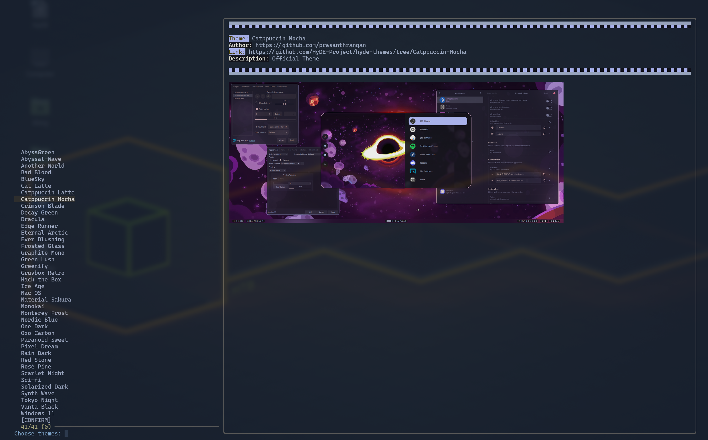

### Pratinjau



### NAMA

theme.import.py - Mengimpor tema dari repositori galeri HyDE

### SINOPSIS

`theme.import.py` [OPSI]

### DESKRIPSI

`theme.import.py` adalah skrip untuk mengimpor dan mengelola tema dari repositori galeri HyDE. Skrip ini memungkinkan pengguna untuk mengkloning repositori, mengambil data tema, melihat pratinjau tema, dan menerapkan tema yang dipilih.

### OPSI

- `-j`, `--json`
  Mengambil data JSON setelah mengkloning repositori.

- `-S`, `--select`
  Memilih tema menggunakan `fzf`.

- `-p`, `--preview` IMAGE_URL
  Mendapatkan pratinjau dari tema yang ditentukan.

- `-t`, `--preview-text` TEKS
  Teks pratinjau yang ditampilkan saat menggunakan opsi `--preview`.

- `--skip-clone`
  Melewati proses kloning repositori.

- `-f`, `--fetch` TEMA
  Mengambil dan memperbarui tema tertentu berdasarkan nama. Gunakan `all` untuk mengambil semua tema yang terletak di `xdg_config/hyde/themes`.

### ENVIRONMENT VARIABLES

- `LOG_LEVEL`
  Menetapkan tingkat logging (default: `INFO`).

- `XDG_CACHE_HOME`
  Direktori untuk file cache (default: `~/.cache`).

- `XDG_CONFIG_HOME`
  Direktori untuk file konfigurasi (default: `~/.config`).

- `FULL_THEME_UPDATE`
  Menimpa file yang diarsipkan (berguna untuk pembaruan dan perubahan dalam arsip).

### CONTOH

Membuka menu fzf dan memilih tema.

```shell
theme.import.py --select
```
