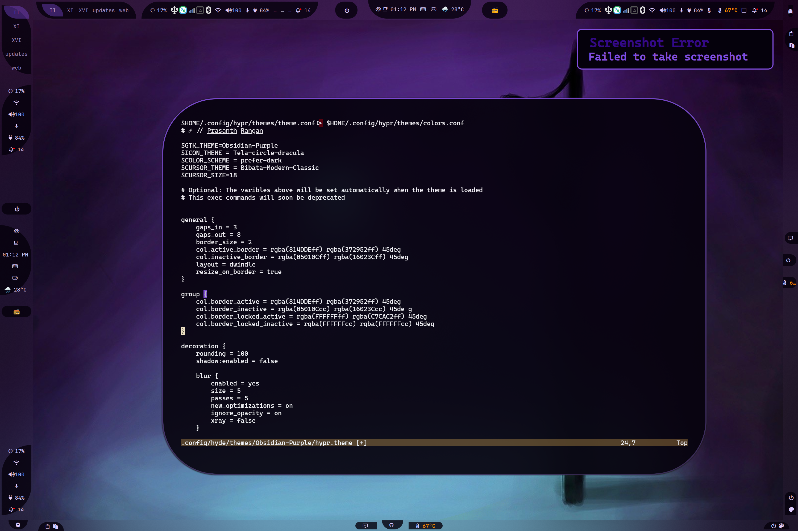
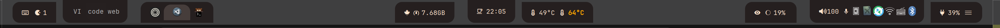

## Árvore de configuração

```text
📂 ~/.config/waybar/
├── 📂 layouts/
├── 📂 menus/
├── 📂 modules/
├── 📂 styles/
├── 📂 includes/
├── 📄 config.jsonc
├── 📄 style.css
├── 📄 theme.css
└── 📄 user-style.css
```

- **config.jsonc**
  - Cópia de uma configuração de layout. See [layouts](#layouts).
  - Um arquivo transitório, logo quaisquer mudanças devem ser feitas em  `~/.config/waybar/layouts/`.
- **style.css**
  - Arquivo gerado automaticamente.
  - O style.css importa 3 arquivos:
    - **Current :** O `styles/*.css` que bate com o `layout.jsonc`. Veja [Estilos](#estilos)
    - **theme.css :** É gerado por temas e pode sobrescrever o estilo selecionado.
    - **user-style.css :** É um arquivo opcional onde você pode adicionar suas próprias sobrescrições. Você também pode testar seu CSS aqui.

- **theme.css**
  - Arquivo gerado pelo tema.

:::note
Você deve saber que o `xdg_share/waybar` (~/.local/share/waybar) é um diretório providenciada pelo HyDE. NUNCA faça alterações neste diretório, já que elas serão sobrescritas nas atualizações. Você deve, em vez disso, editar seu próprio diretório  `~/.config/waybar`! 

Leve em conta que ambas tem a mesma estrutura e que eu sugiro que você copie os arquivos do `xdg_share/waybar` para o `~/.config/waybar`, e os edite lá.

:::

### Módulos

Diretório: `./modules/`

```text
└── 📂 modules/
   ├── 📄 backlight.jsonc
   ├── 📄 clock.jsonc
   ├── 📄 cpu.jsonc
   ├── 📄 custom-cpuinfo.jsonc
   ├── 📄 hyprland-language.jsonc
   ├── 📄 idle_inhibitor.jsonc
   ├── 📄 pulseaudio#microphone.jsonc
   ├── 📄 pulseaudio.jsonc
   ├── 📄 tray.jsonc
   ├── 📄 wlr-taskbar#windows.jsonc
   └── 📄 wlr-taskbar.jsonc
```

- Guarda todos os módulos em `~/.config/waybar/modules/`.
- Arquivos aqui são recursivamente adicionados como entrada no `includes/includes.jsonc`.
- Todos os módulos em uma árvore especifica seguirão a convenção `pai-filho`. Exemplo: `custom/cpuinfo` será convertido em `custom-cpuinfo`. Isto é usada para facilmente determinar o nome da classe no CSS, evitando confusões.

Exemplo:
```css
.custom-cpuinfo {
  padding: 1em;
}
```

### Layouts

Diretório: `./layouts/`

```text
└── 📂 layouts/
   ├── 📄 layout-1.jsonc
   ├── 📄 layout-2.jsonc
   ├── 📄 khing.jsonc
   ├── 📄 macos.jsonc
   └── 📄 ....jsonc
```

O HyDE guarda todos os layouts prontos para usar no diretório `layouts/`. Essas configurações podem ser navegados utilizando o script `hyde-shell waybar`

:::note
Se um usuário acidentalmente configurar o `./waybar/config.jsonc`, ela será movida para o `~/.config/waybar/layouts/backup/name_timestamp.jsonc`. Mesmo com essas medidas, nós te encorajamos a criar uma cópia de sua configuração em `~/.config/waybar/layouts/`.
:::

Para a estilização veja [Estilos](#estilos).

### Estilos

Diretório: `./styles/`

```text
└── 📂 styles/
   └── 📂 groups/
   ├── 📄 layout-1.css
   ├── 📄 layout-2.css
   ├── 📄 khing.css
   ├── 📄 macos.css
   └── 📄 ...*.css
```

O diretório `styles/` contem os arquivos CSS contraparte para os layouts.
Quando você escolhe o layout, o HyDE tentará utilizar o estilo CSS equivalente correspondendo os nomes-base. `khing.jsonc` utilizará o `khing.css`.

Explicitar as opções `--config <file>` e o `--style <file>` também é suportado.

### Includes

Diretório: `./includes/`

```text
└── 📂 includes/
   ├── 📄 includes.jsonc
   ├── 📄 border-radius.css
   └── 📄 global.css
```

- **border-radius.css**
  - Border-radius dinâmico para os [grupos](#groups).

#### Visualização do Border-Radius Dinâmico

**Nenhum arredondamento** no Hyprland


**Squircle** arredondamento 10 no Hyprland


**Circulo** arredondamento 100 no Hyprland



**Entendeu?**

- **global.css** - Inclui o font-size dinâmico, e o font-family. Isso é dinâmico, então temas podem sobrescrever estes valores por via do `hypr.theme` >> `$BAR_FONT`.

### Menus

Diretório: `./menus/`

Guarda todos os arquivos XML de objetos GTK. Para corretamente gerenciar os arquivos, adicionamos os arquivos GObject XML em `~/.config/waybar/menus/`

## Classe de Grupo para Estilização

Você deve saber que o Waybar apenas providencia 3 opções de posicionamento para seus módulos: `modules-left` (Esquerda), `modules-center` (Centro) e `modules-right` (Direita). Para obter o posicionamento desejado ou o popular efeito de "pílula", devemos usar a classe `group`.

For example:


Os conteúdos do `../waybar/styles/groups/` são utilizados para estilizar o `border-radius`. Grupos são as combinações de módulos, vamos chamar eles de ilhas.

Exemplo em `~/.config/waybar/layouts/my_config.jsonc`:

```jsonc
{
  "group/pill": {
    "orientation": "inherit",
    "modules": [
      "custom/gpuinfo",
      "clock"
    ]
  }
}
```

Agora podemos adicionar nosso grupo nos módulos Waybar:

```jsonc
{
  "modules-center": [
    "group/pill",
    "group/pill#tag1",
    "group/pill-in"
  ]
}
```

**Estilização:** Isso é fácil, já que já agrupamos os módulos. Dessa maneira podemos utilizar o nome do grupo como o nome da classe.

```css
#pill,
#pill-in {
  /* Your styles here */
}
```

**Nota:** `pill` e `pill#tag*` usam o nome de classe `pill`. Esta é uma convenção do Waybar que permite aos usuários adicionar módulos semelhantes compartilhando o mesmo nome de classe.

## Criando seu próprio layout Waybar

:::note

Essa é uma guia muito rasa, você deve seguir a [Wiki do Waybar](https://github.com/Alexays/Waybar/wiki/Configuration) para mais informações.

:::


### Este é o arquivo do layout inteiro usada pelas instruções

<details open>
  <summary>MyBar.jsonc</summary>

```jsonc
{
  /* 
  ┌─────────────────────────────────────────────────────────────────────────────┐
  │    Opções globais para a configuração do Waybar                             │
  └─────────────────────────────────────────────────────────────────────────────┘
 */

  "layer": "top",
  "output": ["*"],
  "position": "top",
  "reload_style_on_change": true,

  /* 
  ┌────────────────────────────────────────────────────────────────────────────┐
  │                                                                            │
  │ Isso é uma das partes vitais da configuração, ela permite que você         │
  │ inclua outros arquivos                                                     │
  │ O `"$XDG_CONFIG_HOME/waybar/includes/includes.json"` é gerado pelo         │
  │ waybar.py automaticamente:                                                 │
  │ 1. Inclui todos os módulos em `./waybar/modules                            │
  │ 2. Resolve todos os tamanhos para os icones que o style.css do waybar não  │
  │ consegue lidar                                                             │
  │ 3. Isto obviamente é opcional, e você pode removê-lo se não quer usa-lo, e │
  │ incluir seu próprio conjunto de módulos                                    │
  │                                                                            │
  └────────────────────────────────────────────────────────────────────────────┘
 */

  "include": ["$XDG_CONFIG_HOME/waybar/includes/includes.json"],

  /* 
  ┌────────────────────────────────────────────────────────────────────────────┐
  │ Declare os módulos dentro de seus grupos desejados.                        │
  │  Atualmente temos:                                                         │
  │                                                                            │
  │ - pill-left - a curva está voltada para a esquerda                       │
  │ - pill-right - a curva está voltada para a direita                       │
  │ - pill-up - a curva está voltada para cima                               │
  │ - pill-down - a curva está voltada para baixo                            │
  │ - pill-in - a curva está voltada para dentro, não importa a posição      │
  │ - pill-out - a curva está voltada para fora, não importa a posição       │
  │ - leaf - um formato de folha                                               │
  │ - leaf-inverse - um formato de folha, só que invertida                     │
  │                                                                            │
  └────────────────────────────────────────────────────────────────────────────┘
 */

  "group/pill-left": {
    "orientation": "inherit",
    "modules": ["custom/keybindhint", "custom/updates"]
  },
  "group/pill-right": {
    "orientation": "inherit",
    "modules": ["battery", "custom/hyde-menu"]
  },
  "group/pill-up": {
    "orientation": "inherit",
    "modules": ["wlr/taskbar"]
  },
  "group/pill-down": {
    "orientation": "inherit",
    "modules": ["hyprland/workspaces"]
  },
  "group/pill-in": {
    "orientation": "inherit",
    "modules": ["idle_inhibitor", "clock"]
  },
  "group/pill-out": {
    "orientation": "inherit",
    "modules": ["custom/weather", "hyprland/language"]
  },
  "group/leaf": {
    "orientation": "inherit",
    "modules": ["custom/workflows", "memory"]
  },
  "group/leaf-inverse": {
    "orientation": "inherit",
    "modules": ["custom/gpuinfo", "custom/cpuinfo"]
  },

  /* 
  ┌─────────────────────────────────────────────────────────────────────────┐
  │ Reusar um grupo é simples, basta adicionar um #tag ao nome do grupo     │
  └─────────────────────────────────────────────────────────────────────────┘
 */

  "group/pill-down#right": {
    "orientation": "inherit",
    "modules": ["pulseaudio", "pulseaudio#microphone", "tray"]
  },
  "group/pill-up#right": {
    "orientation": "inherit",
    "modules": ["privacy", "custom/hyprsunset", "backlight#intel_backlight"]
  },

  /* 
  ┌─────────────────────────────────────────────────────────────────────────┐
  │ Declare os grupos na posição do módulo providenciada pelo waybar        │
  └─────────────────────────────────────────────────────────────────────────┘
 */
  "modules-left": ["group/pill-left", "group/pill-down", "group/pill-up"],
  "modules-center": ["group/leaf", "group/pill-in", "group/leaf-inverse"],
  "modules-right": [
    "group/pill-up#right",
    "group/pill-down#right",
    "group/pill-right"
  ]
}

```

</details>


### Guia passo-a-passo

#### Passo 1: Crie seu arquivo de configuração

Comecr criando um arquivo como: `~/.config/waybar/layouts/my_config.jsonc` ou copie um dos arquivos existentes do `~/.local/share/waybar/layouts/`.

```bash
cp ~/.local/share/waybar/layouts/layout-1.jsonc ~/.config/waybar/layouts/my_config.jsonc
```

#### Passo 2: Adicione opções de configuração global

Comece com todas as configurações globais essenciais que definem o comportamento básico de seu Waybar.

```jsonc
{
  "layer": "top",                    // Position layer: "top" or "bottom"
  "output": ["*"],                   // Apply to all monitors (* means all outputs)
  "position": "top",                 // Bar position: top, bottom, left, right
  "reload_style_on_change": true,    // Auto-reload when style file changes
```

#### Passo 3: Inclua definições de módulos HyDE.

Adicione a diretiva `include` para automaticamente carregar todos os módulos e configurações HyDE.

```jsonc
  "include": ["$XDG_CONFIG_HOME/waybar/includes/includes.json"],
```

:::tip
O arquivo `includes.json` é automaticamente gerado pelo script `waybar.py` e providência:
- Todos os módulos do `./waybar/modules/`
- Configuração dos tamanhos dos icones que o CSS não consegue lidar.
- Configurações dinâmicas especificas para o HyDE.
:::

#### Step 4: Define Group Shapes

O HyDE providencia vários formatos de grupo predefinidos para criar layouts customizados e efeitos de pílula. Defina seus grupos antes de atribuir módulos:

```jsonc
  // Grupos de formato dísponiveis:
  // pill-left, pill-right, pill-up, pill-down
  // pill-in, pill-out, leaf, leaf-inverse
  
  "group/pill-left": {
    "orientation": "inherit",
    "modules": ["custom/keybindhint", "custom/updates"]
  },
  "group/pill-right": {
    "orientation": "inherit",
    "modules": ["battery", "custom/hyde-menu"]
  },
  "group/pill-up": {
    "orientation": "inherit",
    "modules": ["wlr/taskbar"]
  },
  "group/pill-down": {
    "orientation": "inherit",
    "modules": ["hyprland/workspaces"]
  },
  "group/pill-in": {
    "orientation": "inherit",
    "modules": ["idle_inhibitor", "clock"]
  },
  "group/pill-out": {
    "orientation": "inherit",
    "modules": ["custom/weather", "hyprland/language"]
  },
  "group/leaf": {
    "orientation": "inherit",
    "modules": ["custom/workflows", "memory"]
  },
  "group/leaf-inverse": {
    "orientation": "inherit",
    "modules": ["custom/gpuinfo", "custom/cpuinfo"]
  },
```

#### Passo 5: Reusar grupos com tags

Você pode reusar o mesmo grupo de formato múltiplas vezes adicionando tags (`#nomedatag`):

```jsonc
  "group/pill-down#right": {
    "orientation": "inherit",
    "modules": ["pulseaudio", "pulseaudio#microphone", "tray"]
  },
  "group/pill-up#right": {
    "orientation": "inherit",
    "modules": ["privacy", "custom/hyprsunset", "backlight#intel_backlight"]
  },
```

#### Step 6: Organize grupos nas posições de módulo

Finalmente, atribua seus grupos para às três posições disponíveis:

```jsonc
  "modules-left": ["group/pill-left", "group/pill-down", "group/pill-up"],
  "modules-center": ["group/leaf", "group/pill-in", "group/leaf-inverse"],
  "modules-right": [
    "group/pill-up#right",
    "group/pill-down#right",
    "group/pill-right"
  ]
}
```

#### Passo 7: Aplique sua configuração

Para usar seu novo layout, execute:

```bash
# Navigate to your layouts using rofi
hyde-shell waybar -S

# Or apply directly
hyde-shell waybar -c ~/.config/waybar/layouts/minha_configuração.jsonc
```


:::note 
Veja hyde-shell waybar --help para mais opções.
:::

### Available Group Shapes

| Formato | Descrição |
|-------|-------------|
| `pill-left` | Curva voltada para a esquerda |
| `pill-right` | Curva voltada para a direita |
| `pill-up` | Curva voltada para cima |
| `pill-down` | Curva voltada para baixo |
| `pill-in` | Curva voltada para dentro, não importa a posição |
| `pill-out` | Curva voltada para dentro, não importa a posição |
| `leaf` | Formato de folha |
| `leaf-inverse` | Formato de folha invertida. |


### Customizando conteúdo do módulo

Para customizar módulos individuais, edite os arquivos em `~/.config/waybar/modules/` ou crie novos seguindo a convenção de nomenclatura descrita em [Modules](#modules) section.


