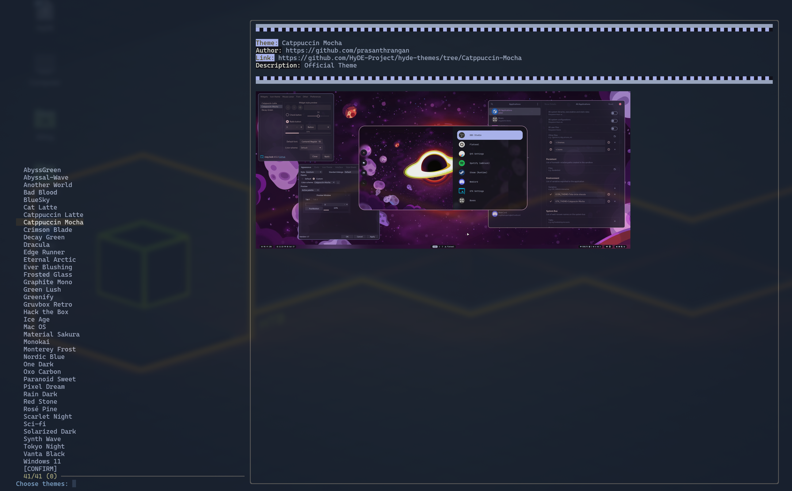

### Предпросмотр



### НАЗВАНИЕ

theme.import.py - Импортирует темы из репозитория галереи HyDE

### КРАТКИЙ ОБЗОР

`theme.import.py` [ОПЦИИ]

### ОПИСАНИЕ

`theme.import.py` — это скрипт для импорта и управления темами из репозитория галереи HyDE. Он позволяет пользователям клонировать репозиторий, получать данные о темах, просматривать темы и применять выбранные темы.

### ОПЦИИ

- `-j`, `--json`
  Получить данные в формате JSON после клонирования репозитория.

- `-S`, `--select`
  Выбрать темы с помощью `fzf`.


- `-p`, `--preview` IMAGE_URL
  Получить предпросмотр указанной темы.

- `-t`, `--preview-text` TEXT
  Текст для предпросмотра, отображаемый при использовании опции `--preview`.

- `--skip-clone`
  Пропустить клонирование репозитория.

- `-f`, `--fetch` THEME
  Получить и обновить конкретную тему по названию. Используйте `all`, чтобы получить все темы, расположенные в `xdg_config/hyde/themes`.

### ENVIRONMENT VARIABLES

- `LOG_LEVEL`
  Установить уровень логирования (по умолчанию: `INFO`).

- `XDG_CACHE_HOME`
  Каталог для кеш-файлов (по умолчанию: `~/.cache`).

- `XDG_CONFIG_HOME`
  Каталог для конфигурационных файлов (по умолчанию: `~/.config`).

- `FULL_THEME_UPDATE`
  Перезаписывает архивные файлы (полезно для обновлений и изменений в архивах).

### ПРИМЕРЫ

Открывает меню fzf и позволяет выбрать темы.

```shell
theme.import.py --select
```
