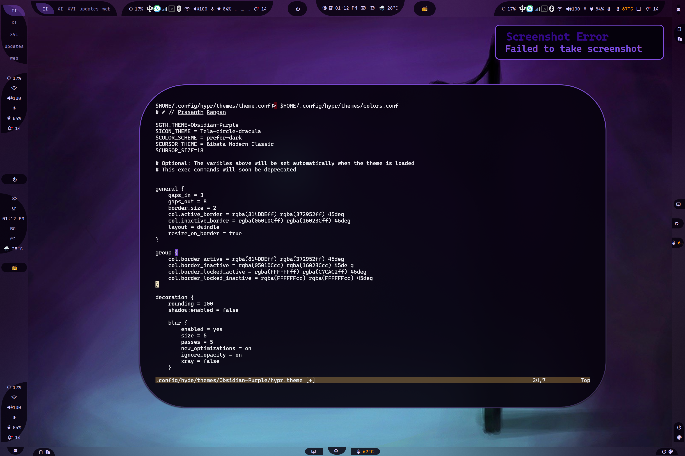
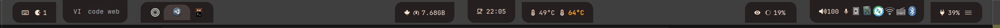
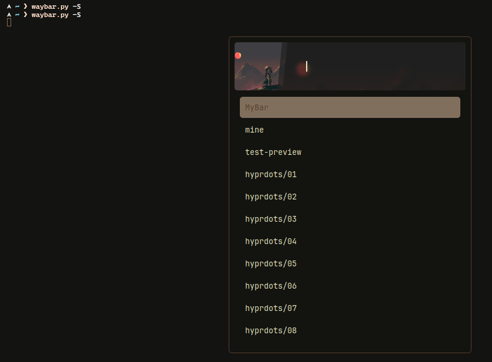

## Структура конфігурації

```text
📂 ~/.config/waybar/
├── 📂 layouts/
├── 📂 menus/
├── 📂 modules/
├── 📂 styles/
├── 📂 includes/
├── 📄 config.jsonc
├── 📄 style.css
├── 📄 theme.css
└── 📄 user-style.css
```

- **config.jsonc**
  - Копія конфігурації макета. Див. [макети](#макети).
  - Це тимчасовий файл, тому зміни слід зберігати у `~/.config/waybar/layouts/`
- **style.css**
  - Автоматично згенерований файл.
  - style.css імпортує 3 файли:
    - **Поточний** `styles/*.css`, що відповідає `layout.jsonc`. Див. [стилі](#стилі)
    - **theme.css**, згенерований темами оформлення, — може перевизначати обраний стиль.
    - **user-style.css** — опційний файл, у якому можна додавати власні перевизначення. Тут також можна тестувати свій CSS.

- **theme.css**
  - Файл, згенерований темою оформлення.

:::note
Варто знати, що `xdg_share/waybar` (~/.local/share/waybar) — це каталог, який надається HyDE. НІКОЛИ не редагуйте файли в цьому каталозі, оскільки вони будуть перезаписані під час оновлень. Замість цього скопіюйте файли з `xdg_share/waybar` до `~/.config/waybar` і редагуйте їх там.
:::

### Модулі

Каталог: `./modules/`

```text
└── 📂 modules/
   ├── 📄 backlight.jsonc
   ├── 📄 clock.jsonc
   ├── 📄 cpu.jsonc
   ├── 📄 custom-cpuinfo.jsonc
   ├── 📄 hyprland-language.jsonc
   ├── 📄 idle_inhibitor.jsonc
   ├── 📄 pulseaudio#microphone.jsonc
   ├── 📄 pulseaudio.jsonc
   ├── 📄 tray.jsonc
   ├── 📄 wlr-taskbar#windows.jsonc
   └── 📄 wlr-taskbar.jsonc
```

- Зберігайте всі модулі у `~/.config/waybar/modules/`.
- Файли звідси рекурсивно додаються як записи в `includes/includes.json`
- Усі модулі в межах певного дерева використовують угоду `parent-child`. Наприклад: `custom/cpuinfo` перетворюється на `custom-cpuinfo`. Це використовується для зручного визначення назви класу в CSS без плутанини.

Приклад:
```css
.custom-cpuinfo {
  padding: 1em;
}
```

### Макети

Каталог: `./layouts/`

```text
└── 📂 layouts/
   ├── 📄 layout-1.jsonc
   ├── 📄 layout-2.jsonc
   ├── 📄 khing.jsonc
   ├── 📄 macos.jsonc
   └── 📄 ....jsonc
```

HyDE зберігає всі готові до використання конфігурації в каталозі `layouts/`. Ними можна керувати за допомогою скрипта `hyde-shell waybar`.

:::note
Якщо користувач випадково налаштує `~/.config/waybar/config.jsonc`, цей файл буде переміщено до `~/.config/waybar/layouts/backup/name_timestamp.jsonc`. Незважаючи на ці заходи, ми рекомендуємо створювати копію своєї конфігурації в `~/.config/waybar/layouts/`.
:::

Про CSS-стилізацію макетів див. у розділі [стилі](#стилі).

### Стилі

Каталог: `./styles/`

```text
└── 📂 styles/
   └── 📂 groups/
   ├── 📄 layout-1.css
   ├── 📄 layout-2.css
   ├── 📄 khing.css
   ├── 📄 macos.css
   └── 📄 ...*.css
```

Каталог `styles/` містить відповідні CSS-файли для макетів.
Під час вибору макета HyDE намагатиметься використати відповідний CSS-стиль, зіставляючи базові назви, наприклад, `khing.jsonc` використовуватиме `khing.css`.

Також підтримуються явні параметри `--config <file>` та `--style <file>`.

### Includes

Каталог: `./includes/`

```text
└── 📂 includes/
   ├── 📄 includes.jsonc
   ├── 📄 border-radius.css
   └── 📄 global.css
```

- **border-radius.css**
  - Динамічний радіус заокруглення для [груп](#клас-групи-для-стилізації).

#### Попередній перегляд динамічного радіуса заокруглення

**Без заокруглення** у Hyprland


**Squircle** заокруглення 10 у Hyprland


**Коло** заокруглення 100 у Hyprland



**Зрозуміло, про що йдеться?**

- **global.css** — містить динамічний розмір і сімейство шрифту. Це зроблено динамічним, щоб теми оформлення могли перевизначати ці значення через `hypr.theme` >> `$BAR_FONT`

### Menus

Каталог: `./menus/`

Зберігає всі GTK-об'єкти у форматі XML. Для коректного керування файлами ми додали XML-файли GObject у `~/.config/waybar/menus/`

## Клас групи для стилізації

Варто знати, що Waybar надає ЛИШЕ 3 варіанти позиціонування модулів: `modules-left`, `modules-center` та `modules-right`. Щоб досягти бажаного позиціонування або популярного ефекту «пігулки» (pill), потрібно використовувати клас `group`.

Наприклад:


Вміст `../waybar/styles/groups/` використовується для стилізації радіуса заокруглення заданої групи. Групи — це комбінація модулів, деякі називають їх «острівцями».

У HyDE, щоб мати змогу використовувати групи, спочатку потрібно оголосити модулі в групі:

Приклад у `~/.config/waybar/layouts/my_config.jsonc`:

```jsonc
{
  "group/pill": {
    "orientation": "inherit",
    "modules": [
      "custom/gpuinfo",
      "clock"
    ]
  }
}
```

Тепер можна додати групу до модулів waybar:

```jsonc
{
  "modules-center": [
    "group/pill",
    "group/pill#tag1",
    "group/pill-in"
  ]
}
```

**Стилізація** — це просто, оскільки ми вже згрупували модулі. Таким чином можна використовувати назву групи як назву класу:

```css
#pill,
#pill-in {
  /* Ваші стилі тут */
}
```

**Примітка:** `pill` та `pill#tag*` мають назву класу `pill`. Це домовленість waybar, яка дозволяє користувачам додавати схожий модуль, зберігаючи спільну назву класу.


## Створення власного макета waybar

:::note

Це доволі поверхневий посібник. Для отримання додаткової інформації варто ознайомитися з [Waybar Wiki](https://github.com/Alexays/Waybar/wiki/Configuration).

:::


### Це повний файл макета, що використовується в інструкціях

<details open>
  <summary>MyBar.jsonc</summary>

```jsonc
{
  /* 
  ┌─────────────────────────────────────────────────────────────────────────────┐
  │     Global Options for the Waybar configuration                             │
  └─────────────────────────────────────────────────────────────────────────────┘
 */

  "layer": "top",
  "output": ["*"],
  "position": "top",
  "reload_style_on_change": true,

  /* 
  ┌────────────────────────────────────────────────────────────────────────────┐
  │                                                                            │
  │ This is one of the vital part of the configuration, it allows you to       │
  │ include other                                                              │
  │ files                                                                      │
  │ The `"$XDG_CONFIG_HOME/waybar/includes/includes.json"` is auto generated   │
  │ by the waybar.py                                                           │
  │ script.                                                                    │
  │ 1. Includes all the modules in `./waybar/modules`                          │
  │ 2. Resolves all the size for the icons that the style.css in waybar        │
  │ CANNOT                                                                     │
  │ handle                                                                     │
  │ 3. Of course this is optional, you can remove it if you don't want to use  │
  │ it and                                                                     │
  │ include your own set of modules.                                           │
  │                                                                            │
  └────────────────────────────────────────────────────────────────────────────┘
 */

  "include": ["$XDG_CONFIG_HOME/waybar/includes/includes.json"],

  /* 
  ┌────────────────────────────────────────────────────────────────────────────┐
  │ Declare the modules inside your desired group shapes                       │
  │  As of now we have:                                                        │
  │                                                                            │
  │ - pill-left - the curve is facing left                                     │
  │ - pill-right - the curve is facing right                                   │
  │ - pill-up - the curve is facing up                                         │
  │ - pill-down - the curve is facing down                                     │
  │ - pill-in - the curve is facing inwards no matter the position             │
  │ - pill-out - the curve is facing outwards no matter the position           │
  │ - leaf - a leaf shape                                                      │
  │ - leaf-inverse - a leaf shape but inverted                                 │
  │                                                                            │
  └────────────────────────────────────────────────────────────────────────────┘
 */

  "group/pill-left": {
    "orientation": "inherit",
    "modules": ["custom/keybindhint", "custom/updates"]
  },
  "group/pill-right": {
    "orientation": "inherit",
    "modules": ["battery", "custom/hyde-menu"]
  },
  "group/pill-up": {
    "orientation": "inherit",
    "modules": ["wlr/taskbar"]
  },
  "group/pill-down": {
    "orientation": "inherit",
    "modules": ["hyprland/workspaces"]
  },
  "group/pill-in": {
    "orientation": "inherit",
    "modules": ["idle_inhibitor", "clock"]
  },
  "group/pill-out": {
    "orientation": "inherit",
    "modules": ["custom/weather", "hyprland/language"]
  },
  "group/leaf": {
    "orientation": "inherit",
    "modules": ["custom/workflows", "memory"]
  },
  "group/leaf-inverse": {
    "orientation": "inherit",
    "modules": ["custom/gpuinfo", "custom/cpuinfo"]
  },

  /* 
  ┌─────────────────────────────────────────────────────────────────────────┐
  │ Re-using a group is simple, You just need to add a #tag to the group     │
  │ name.                                                                   │
  └─────────────────────────────────────────────────────────────────────────┘
 */

  "group/pill-down#right": {
    "orientation": "inherit",
    "modules": ["pulseaudio", "pulseaudio#microphone", "tray"]
  },
  "group/pill-up#right": {
    "orientation": "inherit",
    "modules": ["privacy", "custom/hyprsunset", "backlight#intel_backlight"]
  },

  /* 
  ┌────────────────────────────────────────────────────────────────────────────┐
  │                                                                            │
  │ Declare the groups in the module position provided by waybar               │
  │                                                                            │
  └────────────────────────────────────────────────────────────────────────────┘
 */
  "modules-left": ["group/pill-left", "group/pill-down", "group/pill-up"],
  "modules-center": ["group/leaf", "group/pill-in", "group/leaf-inverse"],
  "modules-right": [
    "group/pill-up#right",
    "group/pill-down#right",
    "group/pill-right"
  ]
}

```

</details>


### Покроковий посібник

#### Крок 1: Створіть файл конфігурації

Почніть зі створення нового файлу `~/.config/waybar/layouts/my_config.jsonc` або скопіюйте один із наявних із `~/.local/share/waybar/layouts/`.

```bash
cp ~/.local/share/waybar/layouts/layout-1.jsonc ~/.config/waybar/layouts/my_config.jsonc
```

#### Крок 2: Додайте глобальні параметри конфігурації

Почніть із базових глобальних налаштувань, що визначають основну поведінку вашого waybar:

```jsonc
{
  "layer": "top",                    // Позиція шару: "top" або "bottom"
  "output": ["*"],                   // Застосувати до всіх моніторів (* означає всі виводи)
  "position": "top",                 // Позиція панелі: top, bottom, left, right
  "reload_style_on_change": true,    // Автоматичне перезавантаження при зміні файлу стилю
```

#### Крок 3: Додайте визначення модулів HyDE

Додайте директиву include, щоб автоматично завантажити всі модулі та конфігурації HyDE:

```jsonc
  "include": ["$XDG_CONFIG_HOME/waybar/includes/includes.json"],
```

:::tip
Файл `includes.json` автоматично генерується скриптом `hyde-shell waybar` в HyDE та надає:
- Усі модулі з `./waybar/modules/`
- Налаштування розміру іконок, з якими не може впоратися CSS
- Динамічні налаштування, специфічні для HyDE
:::

#### Крок 4: Визначте форми груп

HyDE надає кілька попередньо визначених форм груп для створення ефектів «пігулки» та власних макетів. Визначте свої групи перед призначенням модулів:

```jsonc
  // Доступні форми груп:
  // pill-left, pill-right, pill-up, pill-down
  // pill-in, pill-out, leaf, leaf-inverse
  
  "group/pill-left": {
    "orientation": "inherit",
    "modules": ["custom/keybindhint", "custom/updates"]
  },
  "group/pill-right": {
    "orientation": "inherit",
    "modules": ["battery", "custom/hyde-menu"]
  },
  "group/pill-up": {
    "orientation": "inherit",
    "modules": ["wlr/taskbar"]
  },
  "group/pill-down": {
    "orientation": "inherit",
    "modules": ["hyprland/workspaces"]
  },
  "group/pill-in": {
    "orientation": "inherit",
    "modules": ["idle_inhibitor", "clock"]
  },
  "group/pill-out": {
    "orientation": "inherit",
    "modules": ["custom/weather", "hyprland/language"]
  },
  "group/leaf": {
    "orientation": "inherit",
    "modules": ["custom/workflows", "memory"]
  },
  "group/leaf-inverse": {
    "orientation": "inherit",
    "modules": ["custom/gpuinfo", "custom/cpuinfo"]
  },
```

#### Крок 5: Повторне використання груп за допомогою тегів

Ви можете повторно використовувати ту саму форму групи кілька разів, додаючи теги (`#tagname`):

```jsonc
  "group/pill-down#right": {
    "orientation": "inherit",
    "modules": ["pulseaudio", "pulseaudio#microphone", "tray"]
  },
  "group/pill-up#right": {
    "orientation": "inherit",
    "modules": ["privacy", "custom/hyprsunset", "backlight#intel_backlight"]
  },
```

#### Крок 6: Розташуйте групи в позиціях модулів

Тепер можна призначити свої групи на три доступні позиції:

```jsonc
  "modules-left": ["group/pill-left", "group/pill-down", "group/pill-up"],
  "modules-center": ["group/leaf", "group/pill-in", "group/leaf-inverse"],
  "modules-right": [
    "group/pill-up#right",
    "group/pill-down#right",
    "group/pill-right"
  ]
}
```

#### Крок 7: Застосуйте свою конфігурацію

Щоб використати новий макет, виконайте:

```bash
# Перейти до своїх макетів за допомогою rofi
hyde-shell waybar -S

# Або застосувати напряму
waybar -c ~/.config/waybar/layouts/my_config.jsonc
```


:::note 
Дивіться hyde-shell waybar --help для додаткових параметрів.
:::

### Доступні форми груп

| Форма | Опис |
|-------|-------------|
| `pill-left` | Заокруглення повернуте вліво |
| `pill-right` | Заокруглення повернуте вправо |
| `pill-up` | Заокруглення повернуте вгору |
| `pill-down` | Заокруглення повернуте вниз |
| `pill-in` | Заокруглення повернуте всередину незалежно від позиції |
| `pill-out` | Заокруглення повернуте назовні незалежно від позиції |
| `leaf` | Форма листка |
| `leaf-inverse` | Інвертована форма листка |


### Налаштування вмісту модулів

Щоб налаштувати окремі модулі, відредагуйте файли в `~/.config/waybar/modules/` або створіть нові, дотримуючись угоди про іменування, описаної в розділі [Модулі](#модулі).


