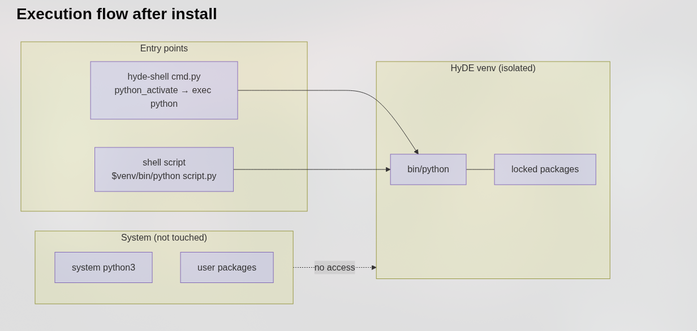

## Назва

`python-env` - менеджер віртуального середовища Python HyDE

## Синтаксис

```bash
python-env [command] [options]
```

## Опис

`python-env` - це менеджер віртуального середовища Python HyDE, побудований на основі [`uv`](https://github.com/astral-sh/uv). Він керує **ізольованим** віртуальним середовищем, що зберігається в `$XDG_STATE_HOME/hyde/python_env` (зазвичай `~/.local/state/hyde/python_env`), повністю окремим від системного Python та будь-яких користувацьких пакетів.

Python-скрипти HyDE виконуються всередині цього середовища. Ви можете розширити його додатковими пакетами, не торкаючись системної інсталяції Python.

### Як це працює



Скрипти HyDE отримують доступ до ізольованого середовища через дві точки входу:

- **`hyde-shell cmd.py`** — активує venv через `python_activate`, а потім виконує `exec` для інтерпретатора Python.
- **Shell-скрипти** — викликають `$venv/bin/python script.py` безпосередньо.

Системний Python і користувацькі пакети ніколи не використовуються.

## Команди

### `create`

```bash
python-env create
```

Створює віртуальне середовище та встановлює всі залежності з `pyproject.toml`. Якщо коректний venv уже існує, крок пропускається. Якщо виявлено пошкоджений venv, він автоматично знищується та перебудовується.

---

### `sync`

```bash
python-env sync
```

Синхронізує залежності з `pyproject.toml` в наявному середовищі. Використовуйте цю команду після отримання оновлень HyDE, щоб середовище залишалося актуальним.

---

### `install`

```bash
python-env install <package> [package ...]
```

Встановлює один або декілька пакетів у venv HyDE за допомогою `uv add`. Пакет додається до `pyproject.toml`, тому зберігається під час перебудов.

**Приклад:**

```bash
python-env install requests pillow
```

---

### `uninstall`

```bash
python-env uninstall <package> [package ...]
```

Видаляє один або декілька пакетів із venv HyDE за допомогою `uv remove`. Також видаляє пакет із `pyproject.toml`.

**Приклад:**

```bash
python-env uninstall pillow
```

---

### `destroy`

```bash
python-env destroy
```

Видаляє весь каталог віртуального середовища. **Не** змінює `pyproject.toml`. Після цього виконайте `create`, щоб відтворити його.

---

### `rebuild`

```bash
python-env rebuild
```

Знищує віртуальне середовище та створює його заново з нуля (виконує `create` та `sync` "під капотом"). Корисно, якщо середовище пошкоджене або після зміни версії Python.

---

### `uv`

```bash
python-env uv [--hyde] <uv-args> ...
```

Передає аргументи безпосередньо базовому виконуваному файлу `uv`. Використовуйте `--hyde`, щоб обмежити команду venv та каталогом проєкту HyDE.

**Параметри:**

**`--hyde`**
: Додає `UV_PROJECT_ENVIRONMENT` та `--project`, щоб команда `uv` без обробки працювала з venv HyDE. Без цього прапорця команда виконується як звичайний виклик `uv` без контексту HyDE.

**Приклади:**

```shell
# Вивести список встановлених пакетів у venv HyDE
python-env uv --hyde pip list

# Виконати uv tree в межах проєкту HyDE
python-env uv --hyde tree
```

## Опційні залежності

Деякі функції HyDE постачаються як **опційні групи залежностей** у `pyproject.toml`. Вони не встановлюються за замовчуванням, щоб середовище залишалося компактним.

### Доступні додаткові пакети (extras)

| Extra | Пакети | Коли встановлювати |
|-------|----------|-----------------|
| `amd` | `pyamdgpuinfo` | Віджети моніторингу GPU AMD |

### Встановлення додаткового пакета

Використовуйте підкоманду `uv` з `--extra`:

```bash
python-env uv --hyde sync --extra amd
```

Це встановлює лише пакети, оголошені в розділі `[project.optional-dependencies]` для цього extra. Це **не** впливає на решту середовища.

:::caution
**Не** використовуйте `python-env install pyamdgpuinfo` для опційних extras — це додало б пакет як звичайну залежність і могло б спричинити конфлікт із майбутніми оновленнями HyDE. Завжди використовуйте `python-env uv --hyde sync --extra <name>` для оголошених extras.
:::

## Безпечне встановлення власних пакетів

Ви можете розширити venv HyDE власними пакетами. Ключове правило: **додавайте лише пакети, які HyDE не оголошує**.

```bash
# Безпечно — додавання пакета, про який HyDE не знає
python-env install my-tool

# Після додавання синхронізація виконується автоматично — додатковий крок не потрібен
```

Щоб зберегти ваші доповнення під час перебудов:

1. Ваші пакети записуються в `pyproject.toml` командою `uv add`, тому вони зберігаються під час `sync`.
2. Повний `rebuild` перевстановить усе, що перелічено в `pyproject.toml`, включно з вашими доповненнями.

:::tip
Якщо потрібний вам пакет конфліктує із залежністю HyDE, **не** встановлюйте його примусово у venv HyDE. Натомість створіть окремий venv для власного скрипта та керуйте ним незалежно за допомогою `uv`.
:::

## Змінні середовища

**`UV_PROJECT_ENVIRONMENT`**
: Перевизначає шлях до venv, який використовує `uv`. Встановлюється внутрішньо `python-env` на `$XDG_STATE_HOME/hyde/python_env`.

**`XDG_STATE_HOME`**
: Базовий каталог для venv (за замовчуванням: `~/.local/state`). venv розташований у `$XDG_STATE_HOME/hyde/python_env`.

## Файли

| Шлях | Опис |
|------|-------------|
| `$XDG_STATE_HOME/hyde/python_env/` | Корінь віртуального середовища |
| `$XDG_STATE_HOME/hyde/python_env/bin/python` | Інтерпретатор Python, який використовують скрипти HyDE |
| `<hyde-dir>/pyproject.toml` | Оголошення залежностей |
| `<hyde-dir>/uv.lock` | Lock-файл — не редагувати вручну |

## Приклади

**Початкове налаштування:**

```bash
python-env create
```

**Оновлення після отримання змін HyDE:**

```bash
python-env sync
```

**Встановлення підтримки GPU AMD:**

```bash
python-env uv --hyde sync --extra amd
```

**Додавання власного пакета:**

```bash
python-env install python-dotenv
```

**Знищення та перебудова пошкодженого середовища:**

```bash
python-env rebuild
```

**Перевірка встановлених пакетів:**

```shell
python-env uv --hyde pip list
```
