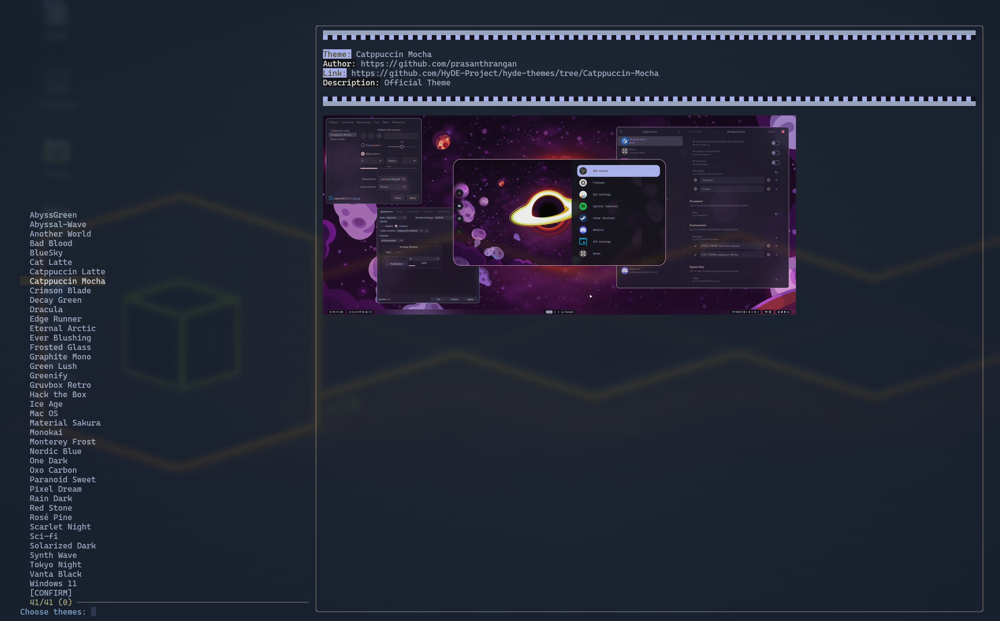

### Попередній перегляд



### НАЗВА

theme.import.py - Імпортує теми з репозиторію галереї HyDE

### СИНТАКСИС

`theme.import.py` [OPTIONS]

### ОПИС

`theme.import.py` - це скрипт для імпорту та керування темами з репозиторію галереї HyDE. Він дає змогу користувачам клонувати репозиторій, отримувати дані тем, переглядати попередній вигляд тем і застосовувати вибрані теми.

### ПАРАМЕТРИ

- `-j`, `--json`
  Отримати дані JSON після клонування репозиторію.

- `-S`, `--select`
  Вибрати теми за допомогою `fzf`.

- `-p`, `--preview` IMAGE_URL
  Отримати попередній перегляд вказаної теми.

- `-t`, `--preview-text` TEXT
  Текст для попереднього перегляду, який відображається під час використання параметра `--preview`.

- `--skip-clone`
  Пропустити клонування репозиторію.

- `-f`, `--fetch` THEME
  Отримати та оновити конкретну тему за назвою. Використовуйте `all`, щоб отримати всі теми, розташовані в `xdg_config/hyde/themes`.

### ЗМІННІ СЕРЕДОВИЩА

- `LOG_LEVEL`
  Встановити рівень журналювання (за замовчуванням: `INFO`).

- `XDG_CACHE_HOME`
  Каталог для файлів кешу (за замовчуванням: `~/.cache`).

- `XDG_CONFIG_HOME`
  Каталог для файлів конфігурації (за замовчуванням: `~/.config`).

- `FULL_THEME_UPDATE`
  Перезаписує архівовані файли (корисно для оновлень і змін в архівах).

### ПРИКЛАДИ

Відкриває меню fzf та вибирає теми.

```shell
theme.import.py --select
```
