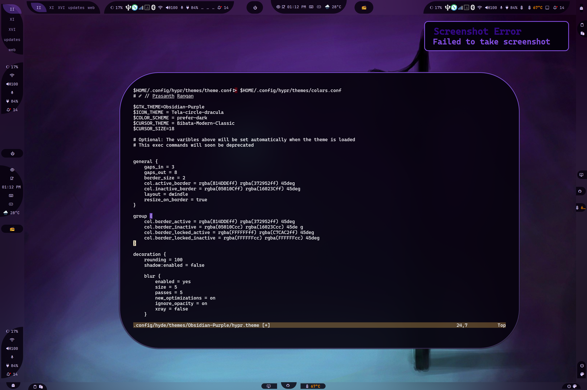

## 配置目录树

```text
📂 ~/.config/waybar/
├── 📂 layouts/
├── 📂 menus/
├── 📂 modules/
├── 📂 styles/
├── 📂 includes/
├── 📄 config.jsonc
├── 📄 style.css
├── 📄 theme.css
└── 📄 user-style.css
```

- **config.jsonc**
  - 布局配置的副本。请参阅 [layouts](#layouts)。
  - 这是一个临时文件，因此必须将编辑保存到 `~/.config/waybar/layouts/` 中。

- **style.css**
  - 自动生成的文件。
  - **style.css** 包含了 3 个文件：
    - **Current** `styles/*.css` 文件与 `layout.jsonc` 匹配。请参阅 [styles](#styles)。
    - **theme.css** 由主题生成，可以覆盖所选样式。
    - **user-style.css** 是一个可选文件，您可以在其中添加自己的覆盖样式，也可以在此测试您自己的 CSS。

- **theme.css**
  - 主题生成的文件。

:::note

请注意，`xdg_share/waybar`（~/.local/share/waybar）是由 HyDE 提供的目录。**切勿**编辑此目录中的文件，因为它们会在更新时被覆盖。您应该编辑您自己的 `~/.config/waybar` 目录！

请注意，这两个目录具有相同的结构。建议您将文件从 `xdg_share/waybar` 复制到 `~/.config/waybar`，然后在那里进行编辑。

:::

### modules

目录: `./modules/`

```text
└── 📂 modules/
   ├── 📄 backlight.jsonc
   ├── 📄 clock.jsonc
   ├── 📄 cpu.jsonc
   ├── 📄 custom-cpuinfo.jsonc
   ├── 📄 hyprland-language.jsonc
   ├── 📄 idle_inhibitor.jsonc
   ├── 📄 pulseaudio#microphone.jsonc
   ├── 📄 pulseaudio.jsonc
   ├── 📄 tray.jsonc
   ├── 📄 wlr-taskbar#windows.jsonc
   └── 📄 wlr-taskbar.jsonc
```

- 所有的模块存储在 `~/.config/waybar/modules/` 中。
- 文件会递归地添加到 `includes/includes.jsonc` 中。

- 特定目录下的所有模块将遵循 `parent-child` 命名约定。例如：`custom/cpuinfo` 将被转换为 `custom-cpuinfo`。这样可以更轻松地在 CSS 中确定类名，避免混淆。

示例：
```css
.custom-cpuinfo {
  padding: 1em;
}
```

### layouts

目录: `./layouts/`

```text
└── 📂 layouts/
   ├── 📄 layout-1.jsonc
   ├── 📄 layout-2.jsonc
   ├── 📄 khing.jsonc
   ├── 📄 macos.jsonc
   └── 📄 ....jsonc
```

HyDE 将所有可用的配置存储在 `layouts/` 目录中。用户可以通过 `waybar.py` 脚本进行导航。

:::note
如果用户不小心修改了 `./waybar/config.jsonc`，该文件将被移动到 `~/.config/waybar/layouts/backup/name_timestamp.jsonc`。尽管有这些保护措施，我们仍然建议在 `~/.config/waybar/layouts/` 中创建配置文件的副本。
:::

有关布局的 CSS 样式，请参阅 [styles](#styles)。

### styles

目录: `./styles/`

```text
└── 📂 styles/
   └── 📂 groups/
   ├── 📄 layout-1.css
   ├── 📄 layout-2.css
   ├── 📄 khing.css
   ├── 📄 macos.css
   └── 📄 ...*.css
```

`styles/` 目录包含布局的对应 CSS 文件。
当选择一个布局时，HyDE 会尝试通过匹配基础名称来使用对应的 CSS 样式，例如 `khing.jsonc` 将使用 `khing.css`。

也支持显式的 `--config <file>` 和 `--style <file>` 选项。

### includes

目录: `./includes/`

```text
└── 📂 includes/
   ├── 📄 includes.jsonc
   ├── 📄 border-radius.css
   └── 📄 global.css
```

- **border-radius.css**
  - 动态边框半径，用于 [groups](#groups)。

#### 动态边框半径预览  

**无圆角** 在 Hyprland  

  

**方圆角** 10 的圆角 在 Hyprland  

  

**圆形** 100 的圆角 在 Hyprland  

  

**明白了吗？**  


- **global.css** - 包含动态字体大小和字体族。这是动态的，因此主题可以通过 `hypr.theme` >> `$BAR_FONT` 覆盖这些值。

### 菜单

目录: `./menus/`

存储所有 GTK 对象 XML 文件。为了正确管理文件，我们将 GObject XML 文件添加到 `~/.config/waybar/menus/` 中。

## 用于样式设计的组类

您应该知道 Waybar 仅提供 3 个模块定位选项：`modules-left`、`modules-center` 和 `modules-right`。要实现所需的定位或流行的药丸效果，我们需要使用 `group` 类。

例如：

`../waybar/styles/groups/` 的内容用于设计给定组的边框半径样式。组是模块的组合 - 有些人称它们为岛屿。

在 HyDE 中，为了能够利用组，我们可以首先在组中声明模块：

`~/.config/waybar/layouts/my_config.jsonc` 中的示例：

```jsonc
{
  "group/pill": {
    "orientation": "inherit",
    "modules": [
      "custom/gpuinfo",
      "clock"
    ]
  }
}
```

现在我们可以将组添加到 waybar 模块中：

```jsonc
{
  "modules-center": [
    "group/pill",
    "group/pill#tag1",
    "group/pill-in"
  ]
}
```

**样式设计**很简单，因为我们已经对模块进行了分组。这样我们可以使用组名作为类名：

```css
#pill,
#pill-in {
  /* 您的样式在这里 */
}
```

**注意：** `pill` 和 `pill#tag*` 的类名都是 `pill`。这是 waybar 的约定，使用户能够添加类似的模块但共享通用类名。

## 制作您自己的 waybar 布局

:::note

这只是一个非常简略的指南。您应该查阅 [waybar Wiki](https://github.com/Alexays/Waybar/wiki/Configuration) 获取更多信息。

:::

### 用于说明的完整布局文件

```jsonc

<details open>
  <summary>MyBar.jsonc</summary>

```jsonc
{
  /* 
  ┌─────────────────────────────────────────────────────────────────────────────┐
  │     Global Options for the Waybar configuration                             │
  └─────────────────────────────────────────────────────────────────────────────┘
 */

  "layer": "top",
  "output": ["*"],
  "position": "top",
  "reload_style_on_change": true,

  /* 
  ┌────────────────────────────────────────────────────────────────────────────┐
    │                                                                            │
    │ 这是配置中至关重要的一部分，它允许您包含其他文件。                           │
    │ `"$XDG_CONFIG_HOME/waybar/includes/includes.json"` 是由 waybar.py 脚本自动生成的。 │
    │                                                                            │
    │ 1. 包含 `./waybar/modules` 中的所有模块。                                   │
    │ 2. 解决了 style.css 无法处理的图标尺寸问题。                                │
    │ 3. 当然，这是可选的。如果您不想使用它，可以将其移除并包含您自己的模块集合。     │
    │                                                                            │
  └────────────────────────────────────────────────────────────────────────────┘
 */

  "include": ["$XDG_CONFIG_HOME/waybar/includes/includes.json"],

  /* 
  ┌────────────────────────────────────────────────────────────────────────────┐
    │ 在您期望的组形状中声明模块                                                │
    │ 目前我们支持以下组形状：                                                  │
    │                                                                          │
    │ - pill-left - 曲线朝左                                                   │
    │ - pill-right - 曲线朝右                                                  │
    │ - pill-up - 曲线朝上                                                     │
    │ - pill-down - 曲线朝下                                                   │
    │ - pill-in - 无论位置如何，曲线朝内                                        │
    │ - pill-out - 无论位置如何，曲线朝外                                       │
    │ - leaf - 叶子形状                                                       │
    │ - leaf-inverse - 叶子形状但反转                                          │
    │                                                                          │
  └────────────────────────────────────────────────────────────────────────────┘
 */

  "group/pill-left": {
    "orientation": "inherit",
    "modules": ["custom/keybindhint", "custom/updates"]
  },
  "group/pill-right": {
    "orientation": "inherit",
    "modules": ["battery", "custom/hyde-menu"]
  },
  "group/pill-up": {
    "orientation": "inherit",
    "modules": ["wlr/taskbar"]
  },
  "group/pill-down": {
    "orientation": "inherit",
    "modules": ["hyprland/workspaces"]
  },
  "group/pill-in": {
    "orientation": "inherit",
    "modules": ["idle_inhibitor", "clock"]
  },
  "group/pill-out": {
    "orientation": "inherit",
    "modules": ["custom/weather", "hyprland/language"]
  },
  "group/leaf": {
    "orientation": "inherit",
    "modules": ["custom/workflows", "memory"]
  },
  "group/leaf-inverse": {
    "orientation": "inherit",
    "modules": ["custom/gpuinfo", "custom/cpuinfo"]
  },

  /* 
  ┌─────────────────────────────────────────────────────────────────────────┐
  │ 重用组非常简单，您只需要在组名称后添加一个 #tag。                          │
  └─────────────────────────────────────────────────────────────────────────┘
 */

  "group/pill-down#right": {
    "orientation": "inherit",
    "modules": ["pulseaudio", "pulseaudio#microphone", "tray"]
  },
  "group/pill-up#right": {
    "orientation": "inherit",
    "modules": ["privacy", "custom/hyprsunset", "backlight#intel_backlight"]
  },

  /* 
    ┌────────────────────────────────────────────────────────────────────────────┐
    │                                                                            │
    │ 在 waybar 提供的模块位置中声明组                                            │
    │                                                                            │
    └────────────────────────────────────────────────────────────────────────────┘
   */

  "modules-left": ["group/pill-left", "group/pill-down", "group/pill-up"],
  "modules-center": ["group/leaf", "group/pill-in", "group/leaf-inverse"],
  "modules-right": [
    "group/pill-up#right",
    "group/pill-down#right",
    "group/pill-right"
  ]
}

```

</details>

### 逐步指南

#### 步骤 1: 创建您的配置文件

首先创建一个新文件 `~/.config/waybar/layouts/my_config.jsonc` 或者从 `~/.local/share/waybar/layouts/` 复制一个现有的文件。

```bash
cp ~/.local/share/waybar/layouts/layout-1.jsonc ~/.config/waybar/layouts/my_config.jsonc
```

#### 步骤 2: 添加全局配置选项

从定义 waybar 基本行为的基本全局配置开始：

```jsonc
{
  "layer": "top",                    // 位置层级："top" 或 "bottom"
  "output": ["*"],                   // 应用于所有显示器（* 表示所有输出）
  "position": "top",                 // 栏位置：top, bottom, left, right
  "reload_style_on_change": true,    // 样式文件更改时自动重新加载
```

#### 步骤 3: 包含 HyDE 模块定义

添加 include 指令以自动加载所有 HyDE 模块和配置：

```jsonc
  "include": ["$XDG_CONFIG_HOME/waybar/includes/includes.json"],
```

:::tip
`includes.json` 文件是由 HyDE 的 `waybar.py` 脚本自动生成的，它提供：
- 来自 `./waybar/modules/` 的所有模块
- CSS 无法处理的图标大小配置
- HyDE 特有的动态配置
:::

#### 步骤 4: 定义组形状

HyDE 提供了几种预定义的组形状，用于创建药丸效果和自定义布局。在分配模块之前定义您的组：

```jsonc
  // 可用的组形状：
  // pill-left, pill-right, pill-up, pill-down
  // pill-in, pill-out, leaf, leaf-inverse
  
  "group/pill-left": {
    "orientation": "inherit",
    "modules": ["custom/keybindhint", "custom/updates"]
  },
  "group/pill-right": {
    "orientation": "inherit",
    "modules": ["battery", "custom/hyde-menu"]
  },
  "group/pill-up": {
    "orientation": "inherit",
    "modules": ["wlr/taskbar"]
  },
  "group/pill-down": {
    "orientation": "inherit",
    "modules": ["hyprland/workspaces"]
  },
  "group/pill-in": {
    "orientation": "inherit",
    "modules": ["idle_inhibitor", "clock"]
  },
  "group/pill-out": {
    "orientation": "inherit",
    "modules": ["custom/weather", "hyprland/language"]
  },
  "group/leaf": {
    "orientation": "inherit",
    "modules": ["custom/workflows", "memory"]
  },
  "group/leaf-inverse": {
    "orientation": "inherit",
    "modules": ["custom/gpuinfo", "custom/cpuinfo"]
  },
```

#### 步骤 5: 使用标签重用组

您可以通过添加标签（`#标签名`）多次重用相同的组形状：

```jsonc
  "group/pill-down#right": {
    "orientation": "inherit",
    "modules": ["pulseaudio", "pulseaudio#microphone", "tray"]
  },
  "group/pill-up#right": {
    "orientation": "inherit",
    "modules": ["privacy", "custom/hyprsunset", "backlight#intel_backlight"]
  },
```

#### 步骤 6: 在模块位置中排列组

最后，将您的组分配到三个可用位置：

```jsonc
  "modules-left": ["group/pill-left", "group/pill-down", "group/pill-up"],
  "modules-center": ["group/leaf", "group/pill-in", "group/leaf-inverse"],
  "modules-right": [
    "group/pill-up#right",
    "group/pill-down#right",
    "group/pill-right"
  ]
}
```

#### 步骤 7: 应用您的配置

要使用您的新布局，请运行：

```bash
# 使用 rofi 导航到您的布局
waybar.py -S

# 或直接应用
waybar -c ~/.config/waybar/layouts/my_config.jsonc
```


:::note 
查看 ./waybar.py --help 获取更多选项。
:::

### 可用的组形状

| 形状 | 描述 |
|-------|-------------|
| `pill-left` | 曲线朝左 |
| `pill-right` | 曲线朝右 |
| `pill-up` | 曲线朝上 |
| `pill-down` | 曲线朝下 |
| `pill-in` | 无论位置如何，曲线朝内 |
| `pill-out` | 无论位置如何，曲线朝外 |
| `leaf` | 叶子形状 |
| `leaf-inverse` | 叶子形状但反转 |


### 自定义模块内容

要自定义单个模块，请编辑 `~/.config/waybar/modules/` 中的文件或按照 [模块](#modules) 部分中描述的命名约定创建新文件。
